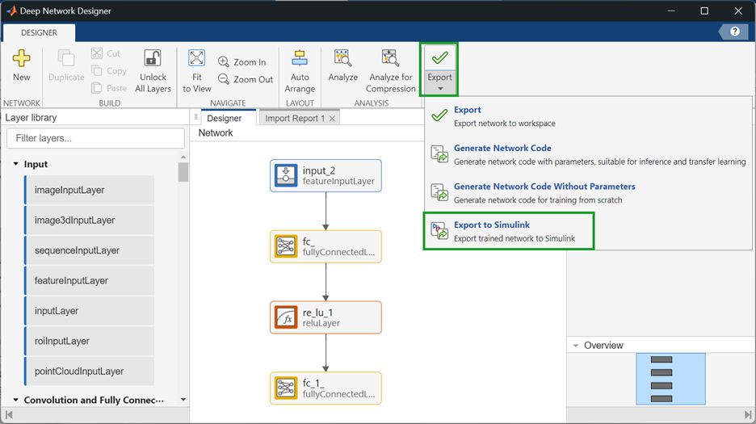
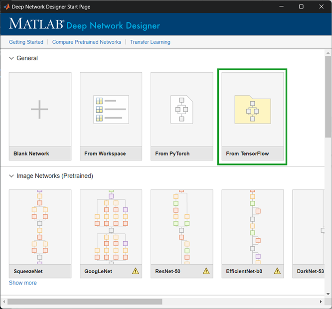
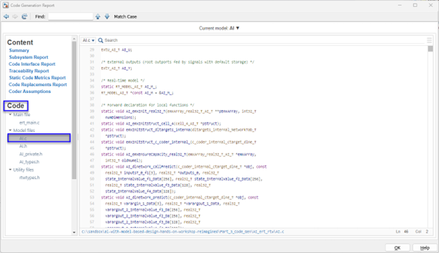

## Embedded AI with Model-Based Design Hands-On Workshop

Welcome to our **AI with Model-Based Design** workshop! This hands-on experience is designed to empower you with the knowledge and skills to develop AI models using MATLAB and Simulink. Whether you're a beginner or an experienced user, this workshop will introduce you to essential tools and methodologies for AI development within Model-Based Design.

Throughout this workshop, you will engage in three comprehensive chapters, each featuring hands-on exercises to solidify your understanding:

1. **Design and Train a Neural Network**: Learn how to create a feedforward neural network and integrate it into a Simulink simulation.

2. **Integrate TensorFlow Models**: Discover how to import a model from TensorFlow and seamlessly integrate it into Simulink.

3. **Model Compression and Code Generation**: Compress an LSTM model using projection, generate C/C++ code from Simulink with Embedded Coder, and profile its performance.

## Setup Instructions

1. **MATLAB Desktop**: This workshop is designed to be delivered on MATLAB Desktop, ensuring you have install MATLAB License and please follow Workshop_Instruction.pdf
2. **On-Site Participants**: If attending an on-site session, please bring your laptop and ensure you have the Google Chrome browser installed

## Call to Action

Embark on your AI development journey with MATLAB and Simulink today! Register for our hands-on workshop with your local sales representative and take the first step towards mastering AI applications with Model-Based Design.

## MathWorks products
* [MATLAB&reg;](https://www.mathworks.com/products/matlab.html)
* [Simulink&reg;](https://www.mathworks.com/products/simulink.html)
* [Deep Learning Toolbox&trade;](https://www.mathworks.com/products/deep-learning.html)
* [Embedded Coder&reg;](https://www.mathworks.com/products/embedded-coder.html)

3rd Party Products:
* [TensorFlow&trade;](https://www.tensorflow.org/)

Copyright 2024 The MathWorks, Inc.